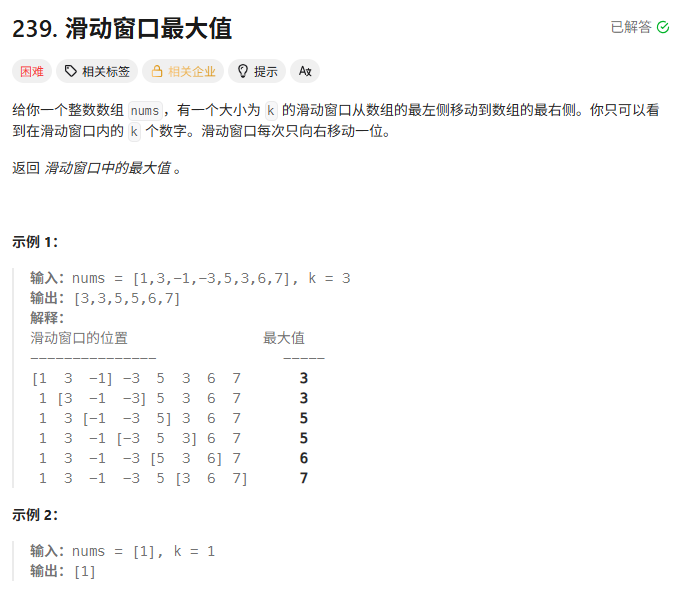

## 思路
- 采用单调队列解法

### 核心思想：
- 用一个双端队列 deque 维护当前窗口内的候选最大值（从大到小排列）。

- 队头永远是当前窗口的最大值
- 新元素进来时，把比它小的元素全部从队尾弹出（它们永远不可能成为最大值）
- 窗口滑动时，把不在窗口内的元素从队头弹出

    - 注意移除超出窗口的元素下标时为dq.front()<=i-k，才能有效让边界弹出
    - 记忆：队头看结果，队尾搞淘汰

### 时间 & 空间复杂度

- 时间复杂度：O(n)
    - 每个元素最多进队、出队各一次
- 空间复杂度：O(k)
    - （最坏情况下队列里有 k 个元素）

## 代码
```c++
class Solution {
public:
    vector<int> maxSlidingWindow(vector<int>& nums, int k) {
        vector<int> ans;
        deque<int> dq; //此处存的是下标

        for(int i=0;i<nums.size();i++){

            //移除超出窗口的元素下标
            if(!dq.empty() && dq.front()<=i-k){
                dq.pop_front();
            }
            //移除比当前元素还要小的元素（注意从队尾移）
            while(!dq.empty() && nums[dq.back()]<nums[i]){
                dq.pop_back();
            }

            //添加元素

            dq.push_back(i);
            //形成窗口后依次放入最大数值也就是队首元素
            if(i>=k-1){
                ans.push_back(nums[dq.front()]);
            }           

        }
        return ans;


    }
};